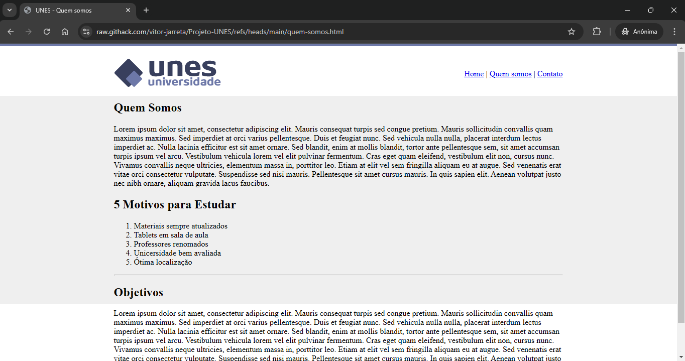

  <h1 align="center">Projeto UNES - Universidade</h1>
  
  
  

   
  
⭐ Favorite no seu Git!! Isso me motiva

   
  
<strong>Compartilhe:</strong>

  
  
  
  
  
  <a href="https://api.whatsapp.com/send?text=https://github.com/vitor-jarreta/Projeto-UNES">

  

  <h3>Sobre o Projeto: </h3>
  
Esse projeto é o começo do meu estudo na linguagen HTML. O Intuito dele é utilizar de várias TAGS de HTML para fazer um protótipo de um site de uma Universidade (fictícia) chamada UNES. Porém, o desafio a mais desse projeto é não utilizar nada de CSS e também não utilizar a TAG de &lt;div&gt; (container). Logo, foi necessário fazer toda a estruturação por meio de tabela, o que, claramente, não é o recomendável para a contrução de um site.

  
Esse projeto foi aplicado e idealizado pelo <a href="https://www.linkedin.com/in/jamiltondamasceno/" target="_blank"><strong>Jamilton Damasceno</strong></a> no curso de <a href="https://www.udemy.com/course/web-completo" target="_blank"><strong>Desenvolvimento Web Completo</strong></a> disponibilizado na Udemy.

  

  <h3>Resultado: </h3>
  <h4>Home: </h4>
  
  <h4>Contato: </h4>
  
  <h4>Quem Somos: </h4>
  

  

  <h3>Interação</h3>
  
Caso queira tem interação com as telas só clicas nos seguintes links:

  <ul>
    <li><a href="https://raw.githack.com/vitor-jarreta/Projeto-UNES/refs/heads/main/index.html" target="_blank">Tela Home</a></li>
    <li><a href="https://raw.githack.com/vitor-jarreta/Projeto-UNES/refs/heads/main/contato.html" target="_blank">Tela Contato</a></li>
    <li><a href="https://raw.githack.com/vitor-jarreta/Projeto-UNES/refs/heads/main/quem-somos.html" target="_blank">Tela Home</a></li>
  </ul>

